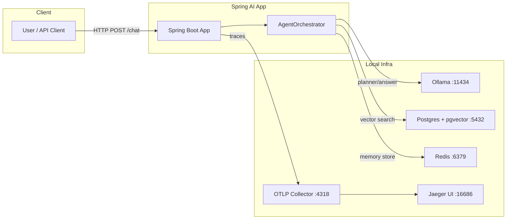
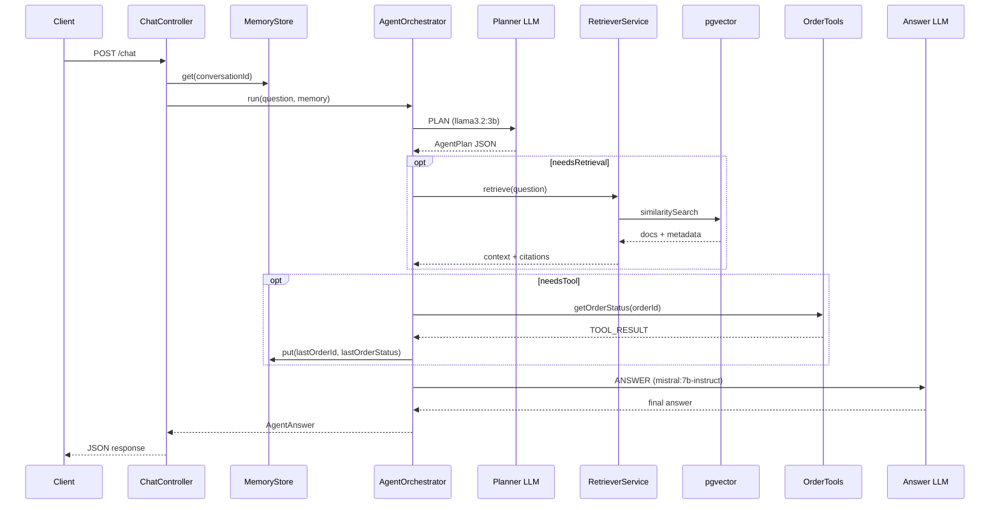
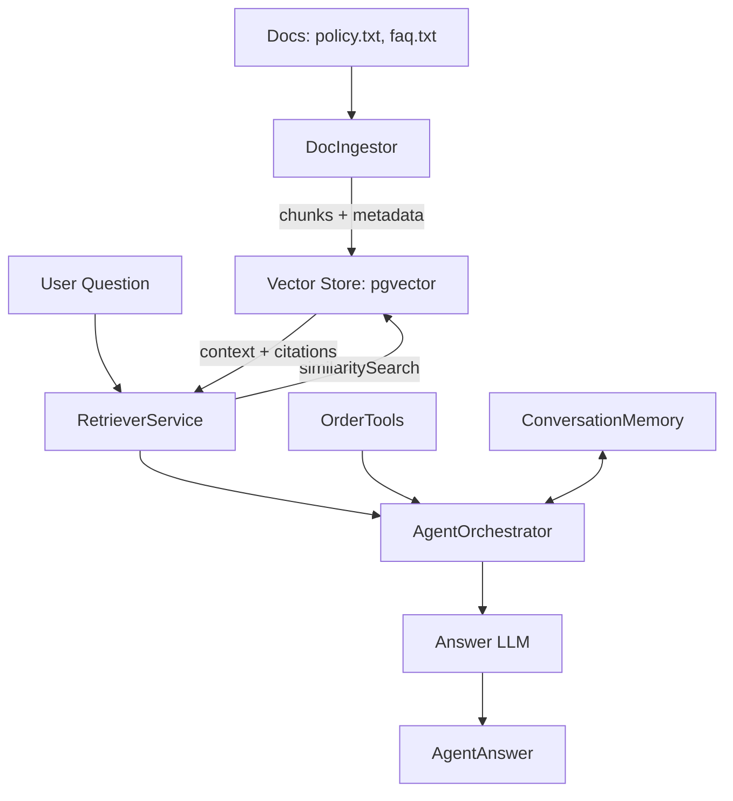

# Architecture Diagram

```mermaid
flowchart TD
    A[Client] -->|POST /chat| B[ChatController]
    B -->|conversationId| C[MemoryStore]
    C -->|ConversationMemory| D[AgentOrchestrator]

    D -->|PLAN (llama3.2:3b)| E[Planner LLM]
    D -->|RETRIEVE| F[RetrieverService]
    F -->|similaritySearch| G[pgvector]
    G --> F
    F -->|context + citations| D

    D -->|TOOL| H[OrderTools.getOrderStatus]
    H -->|writes| C

    D -->|ANSWER (mistral:7b-instruct)| I[Answer LLM]
    I --> D

    D -->|AgentAnswer| B
    B -->|JSON response| A
```

## Notes
- Planner and answer models are routed separately via `app.models.planner` and `app.models.answer`.
- Memory is stored per `conversationId` (Redis or in-memory).
- Retrieval is only for policy/FAQ docs; tools are only for system data.

## Deployment Diagram



## Sequence Diagram



## Data Flow Diagram


